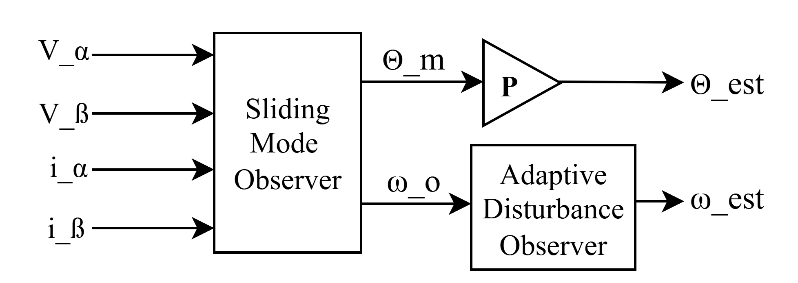
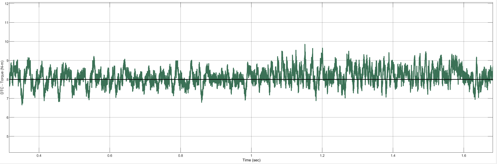

# SVPWM-DTC for PMSM

This repository implements a **Space Vector PWM – Direct Torque Control (SVPWM-DTC)** strategy for **Permanent Magnet Synchronous Motors (PMSM)** with an **Adaptive Sliding Mode Observer (ADO-SMO)** for sensorless speed and position estimation.

---

## Overall System

**Caption:** Simulink block diagram of the complete SVPWM-DTC control system for PMSM, including flux and torque estimators, ADO-SMO, and SVPWM generation.

---

## How It Works

### 1. Sensing & Transformation

The three-phase stator currents and voltages are transformed into the two-phase stationary (α-β) frame using the **Clarke Transformation**. For a balanced system ((i_a + i_b + i_c = 0)), the power-invariant form simplifies to:

$$
\begin{aligned}
i_{\alpha} &= i_{a},\
i_{\beta}  &= \tfrac{1}{\sqrt{3}},(i_{a} + 2,i_{b}).
\end{aligned}
$$

(A full (3 \times 3) Clarke matrix form is also available if the zero-sequence needs to be preserved.)

---

### 2. Flux Estimator

**Caption:** Block diagram of the stator flux estimator in the d-q frame.

The stator flux linkages in the rotating (d)-(q) frame are:

$$
\Psi_{d} = L_{d} i_{d} + \Psi_{m}, \qquad
\Psi_{q} = L_{q} i_{q},
$$

and the total stator flux magnitude:

$$
\Psi_{T} = \sqrt{\Psi_{d}^{2} + \Psi_{q}^{2}}.
$$

---

### 3. Torque Estimator

**Caption:** Block diagram of the electromagnetic torque estimator based on flux and current components.

The electromagnetic torque is given by:

$$
T_{e} = p \left(\Psi_{m} i_{q} + (L_{d} - L_{q}) i_{d} i_{q}\right).
$$

---

### 4. ADO-SMO (Speed & Angle Observer)

**Caption:** Adaptive Disturbance Observer based Sliding Mode Observer (ADO-SMO) used for estimating rotor angle and speed.

We model the stator currents (α-β frame) as:

$$
\begin{aligned}
L_s \frac{di_{\alpha}}{dt} &= -R_s i_{\alpha} + v_{\alpha} - e_{\alpha},\
L_s \frac{di_{\beta}}{dt}  &= -R_s i_{\beta} + v_{\beta} - e_{\beta},
\end{aligned}
$$

where (e_{\alpha}, e_{\beta}) are the back-EMF components (treated as disturbances).

The **Sliding Mode Observer (SMO)** with adaptive disturbance compensation (ADO) is:

$$
\begin{aligned}
L_s \frac{d\hat{i}*{\alpha}}{dt} &= -R_s \hat{i}*{\alpha} + v_{\alpha} - \hat{e}*{\alpha} + g*{\alpha}(\tilde{i}*{\alpha}),\
L_s \frac{d\hat{i}*{\beta}}{dt}  &= -R_s \hat{i}*{\beta}  + v*{\beta} - \hat{e}*{\beta}  + g*{\beta}(\tilde{i}_{\beta}),
\end{aligned}
$$

with estimation error:

$$
\tilde{i} = i - \hat{i}.
$$

The back-EMFs in the stationary frame are related to rotor angle and speed:

$$
\begin{aligned}
e_{\alpha} &= -\omega_e \Psi_m \sin(\theta_e),\
e_{\beta}  &=  \omega_e \Psi_m \cos(\theta_e).
\end{aligned}
$$

From estimated back-EMFs:

$$
\hat{\theta}*e = \arctan!\left(\frac{\hat{e}*{\beta}}{\hat{e}_{\alpha}}\right), \qquad
\hat{\omega}_e = \frac{d\hat{\theta}_e}{dt} ; (\mathrm{filtered}).
$$

The adaptive ADO terms improve robustness against parameter mismatch and load disturbance.

---

## Governing Equations

The PMSM model (in the (d)-(q) frame):

**Voltage equations:**

$$
V_{d} = R_{s}i_{d} + L_{d}\frac{di_{d}}{dt} - \omega_e L_{q} i_{q},
$$

$$
V_{q} = R_{s}i_{q} + L_{q}\frac{di_{q}}{dt} + \omega_e L_{d} i_{d} + \omega_e \Psi_{m}.
$$

**Mechanical equation:**

$$
T_{e} = J\frac{d\omega_{m}}{dt} + B\omega_{m} + T_{L}.
$$

---

## Results

Simulation results are shown below. Each figure demonstrates the behavior of the proposed SVPWM-DTC with ADO-SMO observer under different test conditions.

---

### Figure 1: Speed Tracking

**Caption:** Rotor speed tracking performance under step reference input. The estimated speed (\hat{\omega}) closely follows the reference (\omega_{ref}) with minimal overshoot.

---

### Figure 2: Electromagnetic Torque

**Caption:** Electromagnetic torque response during speed transients. The adaptive observer ensures smooth torque estimation under load variations.

---

### Figure 3: Flux Estimation

**Caption:** Stator flux magnitude estimation using ADO-SMO. The estimated flux follows the actual trajectory accurately even during dynamic operating points.

---

### Figure 4: Stator Currents

**Caption:** Three-phase stator currents in steady-state. The sinusoidal waveform confirms proper SVPWM operation with reduced current ripple.

---

### Figure 5: Load Disturbance Rejection

**Caption:** System response to a sudden load torque disturbance. The ADO-SMO maintains accurate speed and torque estimation despite external perturbations.

---

### Figure 6: Steady-State Performance

**Caption:** Long-term speed tracking performance. The estimated speed and flux remain stable, validating robustness of the proposed control scheme.

---

## References

* Microchip Application Notes on SMO for PMSM control
* NXP Sensorless PMSM Control Guides
* Classical DTC and SVPWM literature
