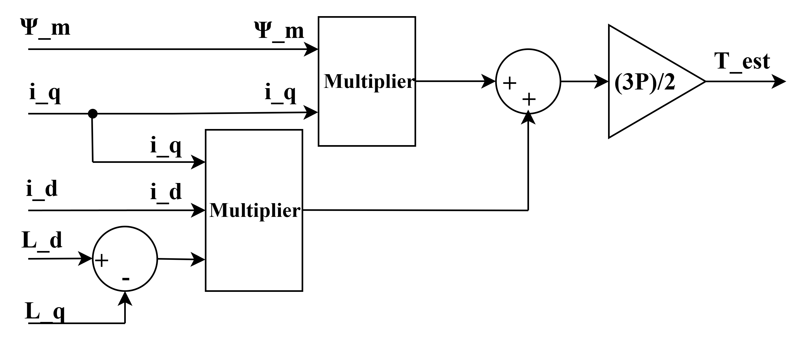

# Visual Guide: Classical DTC with SVPWM for PMSM

This repository provides a visual breakdown of a Simulink model for a classical Direct Torque Control (DTC) scheme using Space Vector Pulse Width Modulation (SVPWM) for a Permanent Magnet Synchronous Motor (PMSM). This serves as a guide to understand the architecture and reconstruct the model.

The control strategy is based on the classical methods detailed in the paper "Advanced Model Predictive Direct Torque Control with Space Vector PWM for Permanent Magnet Synchronous Motors".

### Overall System Diagram

The complete control scheme is shown below. It integrates feedback loops for speed, torque, and flux to regulate the PMSM.

---

## How It Works

The control system operates by continuously sensing the motor's state and adjusting the voltage applied to it via a three-phase inverter.

1.  **Sensing & Transformation**: The motor's speed, currents, and voltages are measured. The three-phase currents and voltages are converted to a two-phase stationary (`α-β`) frame using a Clarke Transformation.
2.  **Estimation**: The actual torque and flux of the motor are calculated in real-time by dedicated estimator blocks.
3.  **Control Loops**:
    * The **speed error** (reference vs. actual) is fed to a PI controller to generate a **reference torque**.
    * The **torque error** (reference vs. estimated) is fed to a PI controller to generate a **reference d-axis voltage**.
    * The **flux error** (reference vs. estimated) is fed to a PI controller to generate a **reference q-axis voltage**.
4.  **Pulse Generation**: An SVPWM block uses the reference d-q voltages to generate the precise gate pulses for the inverter, ensuring a constant switching frequency.

---

## System Components Breakdown

Here are the core estimation components of the Simulink model.

### Torque and Flux Estimators

These blocks are the heart of the DTC scheme, providing the essential feedback values for the control loops.

**Flux Estimator:** This subsystem calculates the total stator flux linkage (`Ψ_T`) from the d-q axis currents. The calculation is based on the equations $\Psi_{d} = L_{d}i_{d} + \Psi_{m}$ and $\Psi_{q} = L_{q}i_{q}$, followed by $\Psi_{T} = \sqrt{\Psi_{d}^{2} + \Psi_{q}^{2}}$.

**Torque Estimator:** This subsystem calculates the motor's electromagnetic torque (`T_e`). It implements the equation $T_{e} = p(\Psi_{m}i_{q} + (L_{d} - L_{q})i_{d}i_{q})$.

---

## Governing Equations

The PMSM model itself is based on the following fundamental d-q frame equations.

* **Voltage Equations:**
    * $V_{d} = R_{s}i_{d} + L_{d}\frac{di_{d}}{dt} - \omega L_{q}i_{q}$
    * $V_{q} = R_{s}i_{q} + L_{q}\frac{di_{q}}{dt} + \omega L_{d}i_{d} + \omega\Psi_{m}$
* **Mechanical Equation:**
    * $T_{e} = J\frac{d\omega_{m}}{dt} + B\omega_{m} + T_{L}$

This visual guide should provide a clear blueprint for understanding and building this SVPWM-DTC control system in Simulink.
